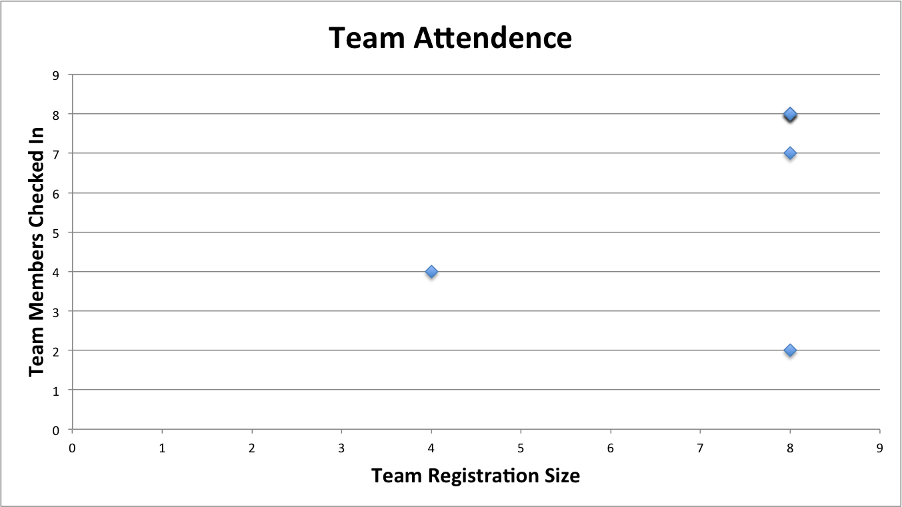
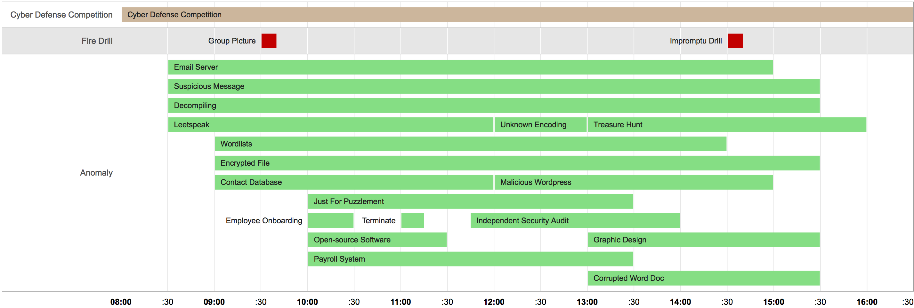
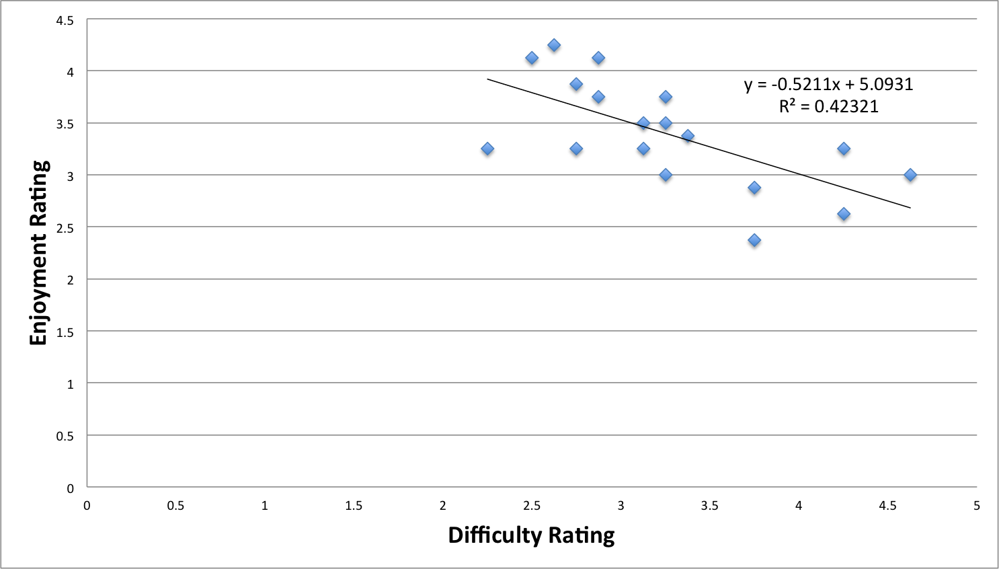

ISU Spring 2014 NCDC Anomalies
==============================

This repository contains a collection of the Iowa State University Spring 2014 National Cyber Defense Competition (NCDC) anomalies and solutions where applicable. The ISU NCDC anomalies are optional challenges that may be completed by participating teams within the allocated challenge time frame to earn additional points during the competition. Some anomalies may be intentionally designed to provoke teams into performing an ill-advised operation that could potentially compromise the security of their network. Other anomalies are simply technical or non-technical challenges designed to engage the participant during the competition in a way that encourages them to learn something new, which may be outside of their expertise or comfort zone.

These anomalies were created for the Iowa State University Spring 2014 National Cyber Defense Competition held on Feburary 8th, 2014. These anomalies are being released under the MIT License in the hopes that they can be reused or in some way aid in learning or promotion of computer security topics. Anomalies contained in this repository were created by Susan Maslo and Ben Holland.

**Disclaimer:** The brief post-analysis of the anomalies given below is the work of Ben Holland and does not reflect the views or opinions of Iowa State University. A best effort was made to collect this data during and after the competition from participant registration, participant check in sheets, the competition scoreboard, and participant feedback. As a result some of the data and analysis may be subject to errors. Note also that some of the challenges contain security relevant materials that could be considered malicious by some. Please use common sense when browsing this and other past anomaly repositories.

## Participation
The ISU Spring 2014 CDC had 8 teams compete in the Cyber Defense Competition.  During the competition one team disbanded and left the competition early leaving 7 teams that finished the competition.

## Anomalies
The competition had a total of 18 anomalies (not including 2 surveys used to collect information about the teams and the statistics used in this write up).  For the majority of the competition multiple overlapping anomalies were active for teams to attempt.  Partial credit was given when grading submissions (when applicable).  This year we held the Fire Drill event at 9:30 AM and again at 2:30 PM.  The Fire Drill event is a tradition for ISU CDC's that aims to catch participants off guard and gives Red Team a short time to perform physical attacks on the Blue team networks.  The first Fire Drill was disguised as a group photo that required participants to gather outside the competition area.  The second Fire Drill event was impromptu and not much attempt was made to disguise it (with the hopes that a second Fire Drill would have been unexpected by participants.

| **Anomaly Name**           | **Max Score** | **Required** | **Released** | **Expired** |    **Time Allowed** |
|----------------------------|:-------------:|:------------:|:------------:|:-----------:|--------------------:|
| Treasure Hunt              |       40      |     FALSE    |   1:00 p.m.  |  4:00 p.m.  |             3 Hours |
| Graphic Design             |       20      |     FALSE    |   1:00 p.m.  |  3:30 p.m.  | 2 Hours, 30 Minutes |
| Corrupted Word Doc         |       30      |     FALSE    |   1:00 p.m.  |  3:30 p.m.  | 2 Hours, 30 Minutes |
| Unknown Encoding           |       20      |     FALSE    |  12:00 p.m.  |  1:00 p.m.  |              1 Hour |
| Malicious Wordpress        |       60      |     FALSE    |  12:00 p.m.  |  3:00 p.m.  |             3 Hours |
| Independent Security Audit |      100      |     FALSE    |  11:45 a.m.  |  2:00 p.m.  | 2 Hours, 15 Minutes |
| Employee Termination       |       20      |     FALSE    |  11:00 a.m.  |  11:15 a.m. |          15 Minutes |
| Just For Puzzlement        |       30      |     FALSE    |  10:00 a.m.  |  1:30 p.m.  | 3 Hours, 30 Minutes |
| Employee Onboarding        |       20      |     FALSE    |  10:00 a.m.  |  10:30 a.m. |          30 Minutes |
| Open-source Software       |      105      |     FALSE    |  10:00 a.m.  |  11:30 a.m. |  1 Hour, 30 Minutes |
| Payroll System             |       80      |     FALSE    |  10:00 a.m.  |  1:30 p.m.  | 3 Hours, 30 Minutes |
| Wordlists                  |       20      |     FALSE    |   9:00 a.m.  |  2:30 p.m.  | 5 Hours, 30 Minutes |
| Encrypted File             |      100      |     FALSE    |   9:00 a.m.  |  3:30 p.m.  | 6 Hours, 30 Minutes |
| Contact Database           |       50      |     FALSE    |   9:00 a.m.  |  12:00 p.m. |             3 Hours |
| Email Server               |       60      |     FALSE    |   8:30 a.m.  |  3:00 p.m.  | 6 Hours, 30 Minutes |
| Suspicious Message         |       80      |     FALSE    |   8:30 a.m.  |  3:30 p.m.  |             7 Hours |
| Decompiling                |      100      |     FALSE    |   8:30 a.m.  |  3:30 p.m.  |             7 Hours |
| Leetspeak                  |       30      |     FALSE    |   8:30 a.m.  |  12:00 p.m. | 3 Hours, 30 Minutes |

## Results

| **Anomaly Name**           | **Submitted** | **Declined** | **Unfinished** | **Average Point Percentage Earned** |
|----------------------------|:-------------:|:------------:|:--------------:|------------------------------------:|
| Treasure Hunt              |      75 %     |      0 %     |      25 %      |                               100 % |
| Graphic Design             |      75 %     |      0 %     |      25 %      |                               100 % |
| Corrupted Word Doc         |      75 %     |      0 %     |      25 %      |                               100 % |
| Unknown Encoding           |      50 %     |      0 %     |      50 %      |                              93.8 % |
| Malicious Wordpress        |      50 %     |      0 %     |      50 %      |                               100 % |
| Independent Security Audit |      75 %     |      0 %     |      25 %      |                              98.3 % |
| Employee Termination       |     62.5 %    |      0 %     |     37.5 %     |                                95 % |
| Just For Puzzlement        |      75 %     |      0 %     |      25 %      |                              59.4 % |
| Employee Onboarding        |     62.5 %    |    12.5 %    |      25 %      |                                78 % |
| Open-source Software       |      75 %     |      0 %     |      25 %      |                              99.2 % |
| Payroll System             |     62.5 %    |      0 %     |     37.5 %     |                              61.5 % |
| Wordlists                  |     62.5 %    |      0 %     |     37.5 %     |                               100 % |
| Encrypted File             |     37.5 %    |      0 %     |     62.5 %     |                                70 % |
| Contact Database           |      25 %     |    25.0 %    |      50 %      |                                50 % |
| Email Server               |      50 %     |      0 %     |      50 %      |                               100 % |
| Suspicious Message         |     37.5 %    |      0 %     |     62.5 %     |                               8.3 % |
| Decompiling                |     100 %     |      0 %     |       0 %      |                                55 % |
| Leetspeak                  |      75 %     |      0 %     |      25 %      |                               100 % |

## Feedback
The `Final Survey` anomaly was used to gather feedback about the competition and each anomaly.  Each team ranked anomalies on a scale of 1 (not at all/not difficult at all) to 5 (a lot/very difficult) concerning enjoyment and difficulty.  As usual, participant feedback for anomalies was mixed.

| **Anomaly**                | **Difficulty** | **Enjoyment** |                                                                                                                                                                                                      **Participant Comments**                                                                                                                                                                                                     |
|----------------------------|:--------------:|:-------------:|:---------------------------------------------------------------------------------------------------------------------------------------------------------------------------------------------------------------------------------------------------------------------------------------------------------------------------------------------------------------------------------------------------------------------------------:|
| Treasure Hunt              |      3.25      |      3.5      |                                                                                                                                                              "These are always fun because you get to get out of here for a little bit." "Very clever. Do it again."                                                                                                                                                              |
| Graphic Design             |      2.625     |      4.25     |                                                                                                                                                                                           "Alex says uh." "Web changes are always fun."                                                                                                                                                                                           |
| Corrupted Word Doc         |      3.375     |     3.375     |                                                                                                                                                                                                         "Didn't complete"                                                                                                                                                                                                         |
| Unknown Encoding           |      3.25      |       3       |                                                                                                                                                                                                            No comments.                                                                                                                                                                                                           |
| Malicious Wordpress        |      3.25      |      3.75     |                                                                                                                                                                                                            No comments.                                                                                                                                                                                                           |
| Independent Security Audit |      2.875     |     4.125     |                                                                                                                                                                                "Great anomaly, very pertinent." "Very realistic, important, great."                                                                                                                                                                               |
| Employee Termination       |      2.25      |      3.25     |                                                                                                                                                    "Not challenging" "I like in the past when there were multiple terminations and onboardings mixed in to up the chaos level."                                                                                                                                                   |
| Just For Puzzlement        |      2.875     |      3.75     |                                                                                                                                                                                    "Spell check needs to happen" "Ran out of time, fun though."                                                                                                                                                                                   |
| Employee Onboarding        |      2.75      |      3.25     |                                                                                                                                                                                 "It wasn't challenging." "Typical sysadmin request, we declined."                                                                                                                                                                                 |
| Open-source Software       |      2.75      |     3.875     |                                                                                                                                                                                           "Pretty easy." "We would like to see it again"                                                                                                                                                                                          |
| Payroll System             |      3.75      |     2.875     |                                                                                                                                                                                                            No comments.                                                                                                                                                                                                           |
| Wordlists                  |      3.125     |      3.5      |                                                                                                                                                                                                "Fun, but done easily with a script"                                                                                                                                                                                               |
| Encrypted File             |      4.625     |       3       |                                                                                                                                                                                                         "Didn't complete"                                                                                                                                                                                                         |
| Contact Database           |      3.75      |     2.375     | "If you have never done anything with databases before, it was extremely difficult." "We just didn't have time." "Didn't complete" "Very interesting request. We declined to do it and would be very happy to talk to our Administrators to explain our reasons. Basically, we would like them to know that we are very committed to making their work easier, however their certain security concerns that we have to consider." |
| Email Server               |      3.125     |      3.25     |                                                                                                         "Scoring engine broke" "Not a suitable anomaly for a learning experience, more of a scenario item." "Already had one set up." "This was a great anomaly, setting up a new server on the fly is always a good one."                                                                                                        |
| Suspicious Message         |      4.25      |      3.25     |                                                                                                                                                                                                "Maybe try a different cipher style"                                                                                                                                                                                               |
| Decompiling                |      4.25      |     2.625     |                                                                                                                                                     "Again, this was more of a "if you have done it before then it is easier, if not then it was impossible" "Didn't complete"                                                                                                                                                    |
| Leetspeak                  |       2.5      |     4.125     |                                                                                                                                                                                                  "Amusing, but not too difficult"                                                                                                                                                                                                 |

